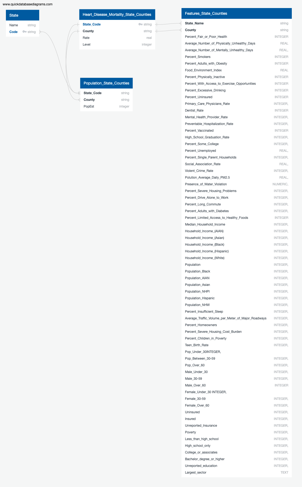
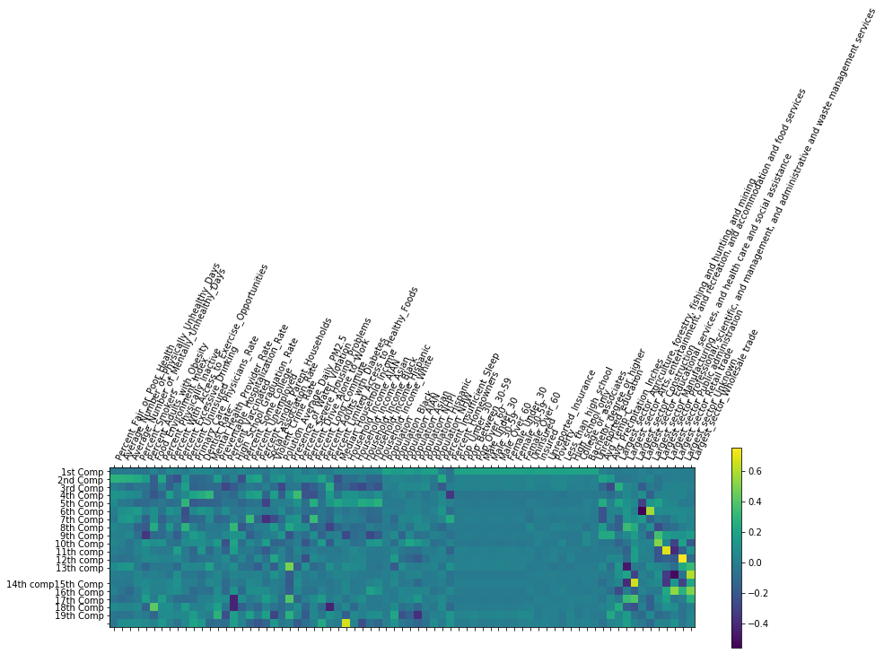
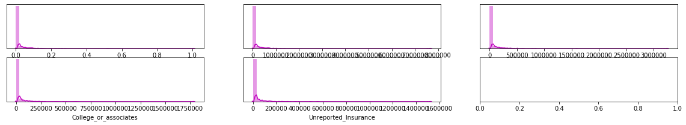
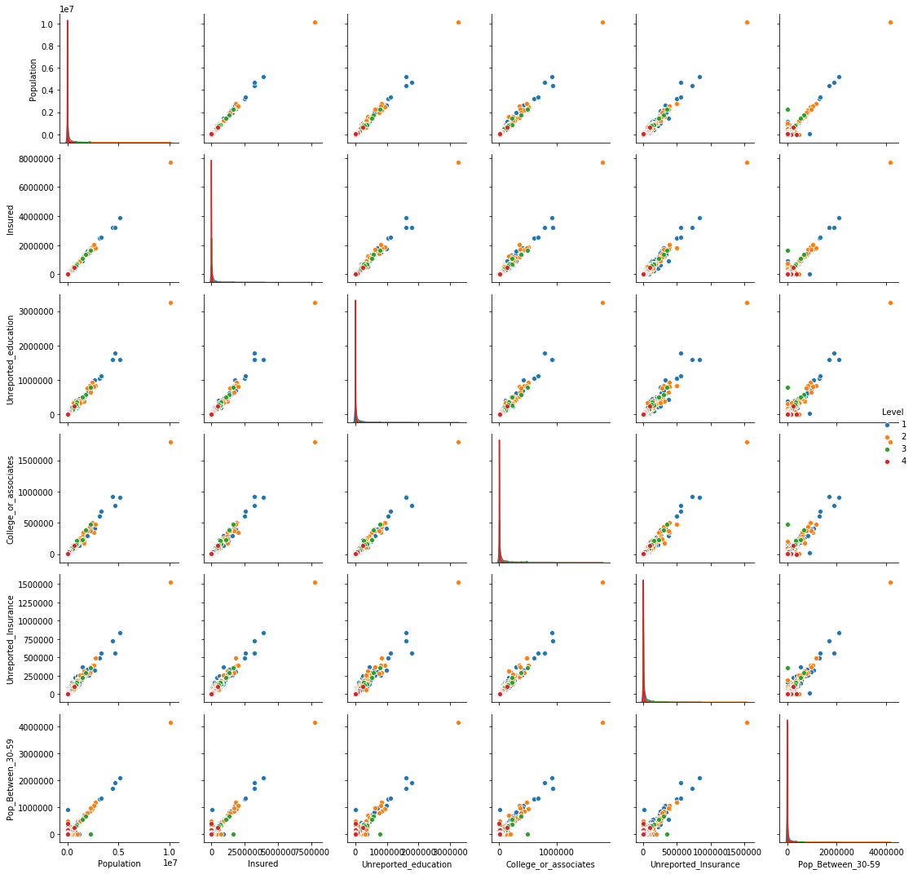
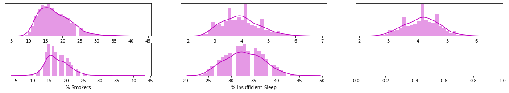
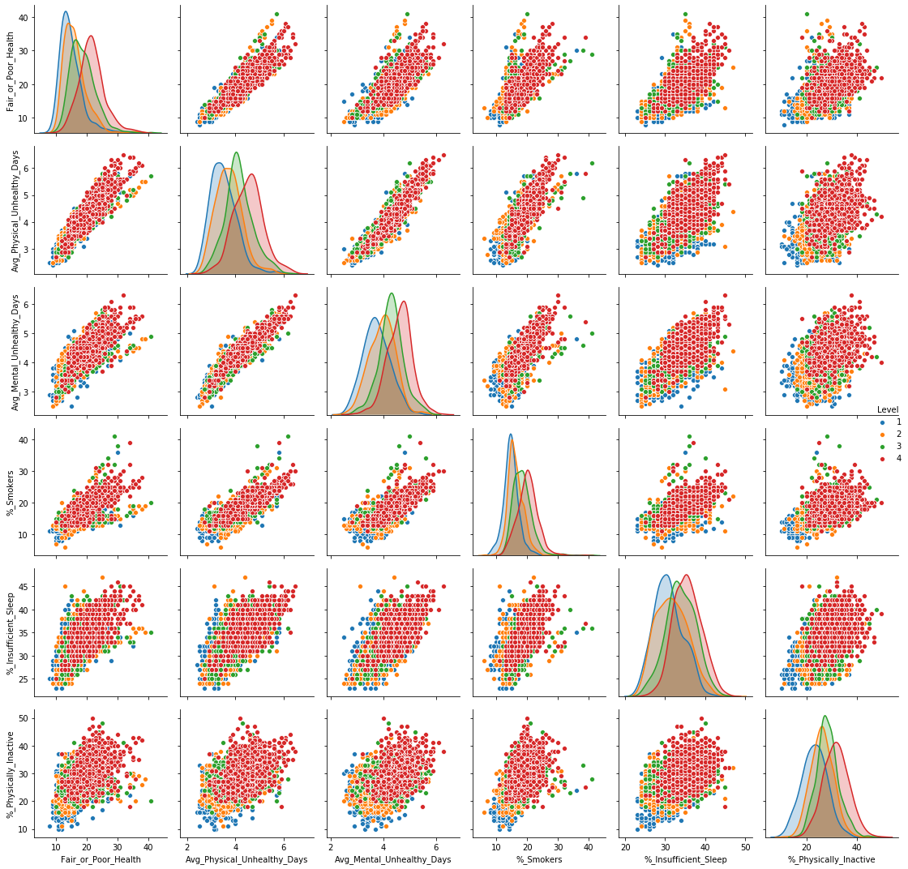

# Heart Disease By County ML

# Project Outline

## Topic
This project focuses on Heart Disease in the United States. Specifically, it attempts to predict the likelihood of heart disease mortality by county. This project compares different Machine Learning models to see the best fit for the use case and the available datasets. 

We chose this topic because of the wide availability of reliable, sourced data as well as some personal interests in heart disease. We hope that we may learn some insightful results regarding the disease prevelance and the factors which surround it.

## Questions to Investigate

    1. What factors are impacting the heart disease mortality in the US, and their significance? 

        a) Are socio-economic, environmental, lifestyle, or health measures more impactful?
        b) How is heart disease mortality correlated or caused by the identified factors? 

    2.What is the correlation or causation between the identifiedfactors and heart disease? 


## Source Data
 The majority of our data are from the 'County Health and Rankings Roadmap', a collaboration between the University of Wisconsin and the Robert Woods foundation. The raw data can be found here: https://www.countyhealthrankings.org/explore-health-rankings/rankings-data-documentation. Its original purpose was to rank each county in the United States by the health quality of its residents. For our purposes, the data outlines various health, life-style and environmental metrics by county in the United States. Some examples of these measures includes Adult Smoking Prevelance, Adult Obesity Prevelance, Education Rankings, Excessive Drinking, and others. 

According to the data compilers, it was sourced from various sources, primarily government agencies. 

They are : 
- National Center for Health Statistics - Mortality Files
- Behavioral Risk Factor Surveillance System
- National Center for Health Statistics - Natality files
- United States Diabetes Surveillance System
- USDA Food Environment Atlas, Map the Meal Gap from Feeding America
- Business Analyst, Delorme map data, ESRI, & US Census Tigerline Files
- Fatality Analysis Reporting System
- National Center for HIV/AIDS, Viral Hepatitis, STD, and TB Prevention
- Small Area Health Insurance Estimates
- Area Health Resource File/American Medical Association
- Area Health Resource File/National Provider Identification file
- CMS, National Provider Identification
- Mapping Medicare Disparities Tool
- State-specific sources & EDFacts
- American Community Survey, 5-year estimates
- Bureau of Labor Statistics
- Small Area Income and Poverty Estimates
- County Business Patterns
- Uniform Crime Reporting - FBI
- Environmental Public Health Tracking Network
- Safe Drinking Water Information System
- Comprehensive Housing Affordability Strategy (CHAS) data

In trying to model the georgraphic presence of heart disease, we are analyzing several features. These include:

*Full Feature List*:
- %_Fair_or_Poor_Health
- Avg_No._Physically_Unhealthy_Days	
- Avg_No._Mentally_Unhealthy_Days	
- %_Smokers
- %_Adults_Obesity	
- Food_Environment_Index	
- %_Physically_Inactive	
- %_Access_to_Exercise_Opportunities	 
- %_Excessive_Drinking	
- %_Uninsured	
- Primary_Care_Physicians_Rate	
- Dentist_Rate	
- Mental_Health_Provider_Rate	
- Preventable_Hospitalization_Rate	
- %_Vaccinated	
- High_School_Graduation_Rate	
- %_Some_College	
- %_Unemployed	
- %_Single_Parent_Households	
- Social_Association_Rate	
- Violent_Crime_Rate	
- Polution_Average_Daily_PM2.5	
- Presence_of_Water_Violation	
- %_Severe_Housing_Problems	
- %_Drive_Alone_to_Work	
- %_Long_Commute	
- %_Adults_with_Diabetes	
- %_Limited_Access_to_Healthy_Foods
- %_Insufficient_Sleep
- Average_Traffic_Volume_per_Meter_of_Major_Roadways
- %_Homeowners
- %_Severe_Housing_Cost_Burden
- %_Children_in_Poverty
- Teen_Birth_Rate
- Uninsured
- Insured
- Unreported_Insurance
- Poverty
- Less_than_high_school
- High_school_only
- College_or_associates
- Bachelor_degree_or_higher
- Unreported_education

 Additionally, we augmented to these data by including county population, population split by age/gender and median household income. 
 
- Median_Household_Income
- Household_Income_AIAN
- Household_Income_Asian
- Household_Income_Black
- Household_Income_Hispanic
- Household_Income_White 
- Population
- Population_Black
- Population_AIAN
- Population_Asian
- Population_NHPI
- Population_Hispanic
- Population_NHW
- Pop_Under_30
- Pop_Between_30-59
- Pop_Over_60
- Male_Under_30
- Male_30-59
- Male_Over_60
- Female_Under_30
- Female_30-59
- Female_Over_60
 
 These data were sourced from the USDA Economic Research Service.

 Also we augmented data with Largest job sector in each county, Temperature and Percipatation 

- Largest_sector
- Avg_Temperature
- Avg_Temp_C
- Avg_Precipitation_Inches

## Database Design

We utilized SQLite as our database engine. We chose SQLite because of its local storage, allowing us to more easily manipualte the data without setting up a more formal engine.

For conceptual purposes, our team developed an Entity Relationship Diagram to clearly demonstrate how our source data relate to one another. This diagram can be seen here:



The two primary keys which bind all the source data together are  State Code, a two letter abbreviation for each state, and County Name. 

- Parent Table "State" holds Name, Code. 
- Second Table "Heart_Disease_Mortality_State_Counties" holds mortality rate per 100,000, which was then classified into four levels: 1, 2, 3, 4.
- Third table "Features_State_Counties" holds most of the features.
- Fourth table "Population_State_Counties" holds population data. 

## Machine Learing 

### Pre-processing
The data stored in SQLite is loaded into a jupyter notebook after connecting the database. The dataframe is read-in using SQL given it is the base language of the data engine.

Next, some data scrubbing takes place. This includes investigating using boxplots and removing outliers if deemed necessary (Average_Traffic_Volume) for instance, searching and removing null values or replacing with zeros.

Next, target values and feature dataframes are established. In this project, mortality "level" is the target value. Each county is assigned a heart disease mortality level, caluclated using quartiles. Meaning the counties with the lowest levels of heart disease mortality are assigned a level of 1, and the highest quartile a level of four. Our model will attempt to predict which level a county belongs to using a testing dataset after being trained.

### Splitting in training and testing sets

The overall dataset was transformed into testing and training sets using train_test_split module from SciKitLearn. This was done for both the x variables (featues) and y-target variable (level). Additionally, each testing and training set was scaled for easier computing and uniformity utilizing StandardScaler. This module alters the data so that it has a mean of 0 and a standard deviation of 1. 


### Models

Our team tested a number of machine learning methods in an attempt to find the most effective in predicitng the level of heart disease mortality per county. In evaluating the models, we used accuracy and recall as a base metric to compare the models to eachother. All of our models were analyzed via SciKitLearn. 

Based on the Exploratory Data Ananlysis we decided on a Machine Learning model using a Random Forest Classisifer to make the prediction. Additionally, our model will rank the various features in the dataset to relate their impact on heart disease.

Below is a link to the decision tree's used by our Random Forest Classifier:
https://heart-disease-by-county.surge.sh/tree.html

We also tried to do dimension reduction using PCA, by plotting cummulative explained variance ration and number of components we arrived at optimum number of components 20 which covers 80% of variance. 

This figure shows the PCA with different feature rankings/contribution 
. 

Images below show the density plot and distribution for top 6 features from Component 1





The PCA dimension reduction was subsequently fed into the Machine Learning Random Forest Classifier Model, which returned an accuracy of close to 49%.

## Dashboard

Independent users may interact with the data set via Tableau public here: https://public.tableau.com/profile/matt.root#!/vizhome/Heart_Disease_Features/Dashboard1?publish=yes

This dashboard includes a number of visualizations that highlight the main findings of the machine learning model and our team's analysis. They include:

1. An interactive heat map where a user can select a feature that heavily impacts heart disease mortality and be shown where in the country the feature is prevelant.

2. A bar chart highlighting the 5 most determinant features in the model.

3. A heat chart ranking feature importance.

 A thorough dashboard description can be found here: [Dashboard_Description.md](Dashboard_Description.md)

## Technology Reference

[technology.md](technology.md)

## Google Slides

Link to presentation: https://docs.google.com/presentation/d/1qPEiTcT5hdARe0zSVPUw2gLa-lvXnCOFxAzWB8XS0uM/edit?usp=sharing

### Team Communication: Agile Methodology 
---


[https://www.openxcell.com/blog/agile-methodology-important-start/](https://www.openxcell.com/blog/agile-methodology-important-start/)

- Private Slack Channel
- https://app.zenhub.com (Open New Feature and Tracking Issue)
- Github for repository

### Git Hub Team Collaboration
--- 

**Git Setup:**

- The master branch is protected from pushing directly
- Each team member needs to create a feature branch from the master branch. The feature branch name should be **yourname** or **yourname_feature**
- When a team member finishes the feature, then open the new pull request (create a merge to master request). The pull request needs to approve by at other team members
- After the pull request is successful, you can keep your feature branch or delete, and create a next new feature branch

**Git Commands:**

Refer: [Git Common Commands](GitCommands.md)

- Create a new feature branch

```Python
# Clone
$ git clone https://github.com/Khanguye/HeartDiseaseByCounty_ML.git

# Switch Directory
$ cd HeartDiseaseByCounty_ML

# Create new branch
$ git checkout -b yourname_feature

# Push up to remote GitHub
$ git push -u origin yourname_feature
```

- Check in the feature branch to remote branch

```Python
# Add files in Staging
$ git add .
# Or one file in Staging
$ git add fileName
# Commit in Staging
$ git commit -m "Clear Label Message"
# Push back to remote
$ git push 
```

- Merge from the master branch

```Python
# Ensure you are on the corrected branch
$ git checkout feature
# Merge from master
$ git merge master
# Or
$ git merge feature master
```
