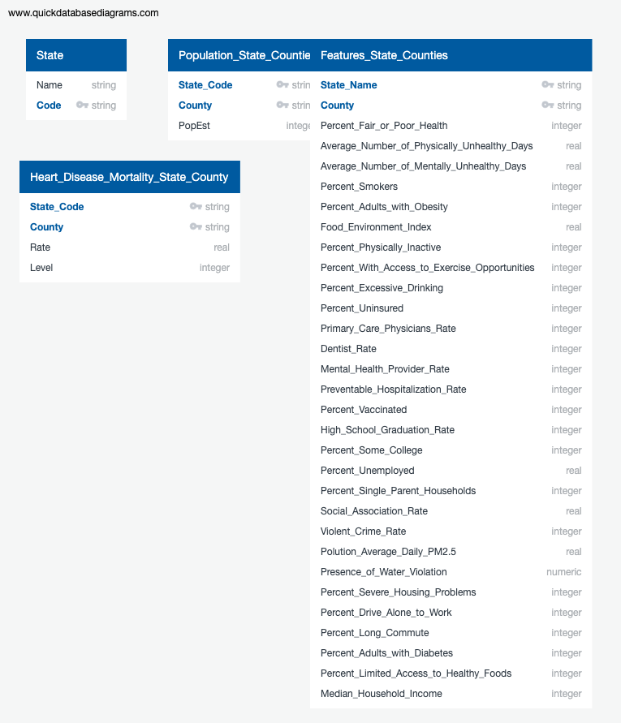

# Heart Disease By County ML

# Project Outline

## Topic
This project focuses on Heart Disease in the United States. Specifically, it attempts to predict the likeliehood of heart disease mortality by county. We developed a Machine-Learning model using a Random Forest Classisifer to make the prediction. Additionally, our model will rank the various features in the dataset by the impact on heart disease.

We chose this topic because of the wde availability of reliable, sourced data as well as some personal connections to heart disease. We hope that we may learn some insightful results regarding the disease prevelance and the factors which surround it.

## Source Data
 The majority of our data are from the 'County Health and Rankings Roadmap', a collaboration between the University of Wisconsin and the Robert Woods foundation. The raw data can be found here: https://www.countyhealthrankings.org/explore-health-rankings/rankings-data-documentation. Its original purpose was to rank each county in the United STates by teh health quality of its residents. For our purposes, the data outlines various health, life-style and environmental metrics by county in the United States. Some examples of these measures includes Adult Smoking Prevelance, Adult Obesity Prevelance, Education Rankings, Excessive Drinking, and others. 

According to the data compilers, it was sourced from various sources, primarily government agencies. 

They are : 
National Center for Health Statistics - Mortality Files
Behavioral Risk Factor Surveillance System
National Center for Health Statistics - Natality files
United States Diabetes Surveillance System
USDA Food Environment Atlas, Map the Meal Gap from Feeding America
Business Analyst, Delorme map data, ESRI, & US Census Tigerline Files
Fatality Analysis Reporting System
National Center for HIV/AIDS, Viral Hepatitis, STD, and TB Prevention
Small Area Health Insurance Estimates
Area Health Resource File/American Medical Association
Area Health Resource File/National Provider Identification file
CMS, National Provider Identification
Mapping Medicare Disparities Tool
State-specific sources & EDFacts
American Community Survey, 5-year estimates
Bureau of Labor Statistics
Small Area Income and Poverty Estimates
County Business Patterns
Uniform Crime Reporting - FBI
Environmental Public Health Tracking Network
Safe Drinking Water Information System
Comprehensive Housing Affordability Strategy (CHAS) data

In trying to model the georgraphic presence of heart disease, we are analyzing several features. These include:

Full Feature List:
Percent_Fair_or_Poor_Health
Average_Number_of_Physically_Unhealthy_Days	
Average_Number_of_Mentally_Unhealthy_Days	
Percent_Smokers	Percent_Adults_with_Obesity	
Food_Environment_Index	
Percent_Physically_Inactive	
Percent_With_Access_to_Exercise_Opportunities	
Percent_Excessive_Drinking	
Percent_Uninsured	
Primary_Care_Physicians_Rate	
Dentist_Rate	
Mental_Health_Provider_Rate	
Preventable_Hospitalization_Rate	
Percent_Vaccinated	
High_School_Graduation_Rate	
Percent_Some_College	
Percent_Unemployed	
Percent_Single_Parent_Households	
Social_Association_Rate	
Violent_Crime_Rate	
Polution_Average_Daily_PM2.5	
Presence_of_Water_Violation	
Percent_Severe_Housing_Problems	
Percent_Drive_Alone_to_Work	
Percent_Long_Commute	
Percent_Adults_with_Diabetes	
Percent_Limited_Access_to_Healthy_Foods	
Median_Household_Income
Average Temperature

The raw data provided more features than these, but we deemed some irrelevant to the questions we wanted to ask.

 Additionally, we augmented to these data by including county population and median household income. These data were sourced from the USDA Economic Research Service.

## Database Design

We utilized SQLite as our database engine. We chose SQLite because of its local storage, allowing us to more easily manipualte the data without setting up a more formal engine.

For conceptual purposes, our team developed an Entity Relationship Diagram to clearly demonstrate how our source data relate to one another. This diagram can be seen here:



The primary key which binds all the source data together is State Code, a two letter abbreviation for each state joined with the respective counties. The individual tables are three raw data tables and one mapping table. The mapping table is used to tie a State name to its code (primary key). The raw data files have the features the model is investigating, and the heart disease rates by state.

The foreign key relationship is not show because of the incompleteness of some data sources. The database is still in development phase and this can be amended as the model progresses.

## Machine Learing 

### Pre-processing
The data, stored locally using SQLite, is loaded into a jupyter notebook after connecting the database. The dataframe is read-in using SQL given it is the base language of the data engine.

Next, some data scrubbing takes place. This includes investigating using boxplots and removing outliers if deemed necessary (Average_Traffic_Volume) for instance, searching and removing null values or replacing with zeros.

Next, target values and feature dataframes are established. In this project's case "level" is the target value. Each county is assigned a heart disease mortality level, caluclated using quartiles. Meaning the counties with the lowest levels of heart disease mortality are assigned a level of 1, and the highest quartile a level of four. Our model will attempt to predict which level a county belongs to using a testing dataset after being trained.

### Splitting in training and testing sets

The overall dataset was transformed into testing and training sets using train_test_split module from SciKitLearn. This was done for both the x variables (featues) and y-target variable (level). Additionally, each testing and training set was scaled for easier computing and uniformity utilizing StandardScaler. This module alters the data so that it has a mean of 0 and a standard deviation of 1. 


### Models

Our team tested a number of machien learnign methods in an attempt to find the most effective in predicitng the level of heart disease mortality per county. In evaluating the models, we used accuracy as a base metric to compare the models to eachother. All of our models were imported via SciKitLearn. In 


## Dashboard

Indepndent users may interact with the data set via Tableau public here: https://public.tableau.com/profile/matt.root#!/vizhome/Heart_Disease_Features/Dashboard1?publish=yes

This dashboard includes a number of visualizations that highlight the main findings of the machine learning model and our team's analysis. They include:

1. An interactive heat map where a user can select a feature that heavily impacts heart disease mortality and be shown where in the country the feature is prevelant.

2. A bar chart highlighting the 5 most determinant features in the model.

3. A heat chart ranking feature importance.

 A thorough dashboard description can be found here: [Dashboard_Description.md](dashboard/Dashboard_Description.md)

## Technology Reference

[technology.md](technology.md)

## Question to Investigate

    1. Which factors are most significant in Heart Disease mortality in the U.S>?

        1a.Are environmental, lifestyle or health measures more impactful?

    2.Which areas of the country suffer greatest with respect to heart disease?

        2a. Which counties fair better and why?


## Google Slides

Link to presentation: https://docs.google.com/presentation/d/1qPEiTcT5hdARe0zSVPUw2gLa-lvXnCOFxAzWB8XS0uM/edit?usp=sharing

### Team Communication: Agile Methodology 
---


[https://www.openxcell.com/blog/agile-methodology-important-start/](https://www.openxcell.com/blog/agile-methodology-important-start/)

- Private Slack Channel
- https://app.zenhub.com (Open New Feature and Tracking Issue)
- Github for repository

### Git Hub Team Collaboration
--- 

**Git Setup:**

- The master branch is protected from pushing directly
- Each team member needs to create a feature branch from the master branch. The feature branch name should be **yourname** or **yourname_feature**
- When a team member finishes the feature, then open the new pull request (create a merge to master request). The pull request needs to approve by at other team members
- After the pull request is successful, you can keep your feature branch or delete, and create a next new feature branch

**Git Commands:**

Refer: [Git Common Commands](GitCommands.md)

- Create a new feature branch

```Python
# Clone
$ git clone https://github.com/Khanguye/HeartDiseaseByCounty_ML.git

# Switch Directory
$ cd HeartDiseaseByCounty_ML

# Create new branch
$ git checkout -b yourname_feature

# Push up to remote GitHub
$ git push -u origin yourname_feature
```

- Check in the feature branch to remote branch

```Python
# Add files in Staging
$ git add .
# Or one file in Staging
$ git add fileName
# Commit in Staging
$ git commit -m "Clear Label Message"
# Push back to remote
$ git push 
```

- Merge from the master branch

```Python
# Ensure you are on the corrected branch
$ git checkout feature
# Merge from master
$ git merge master
# Or
$ git merge feature master
```
