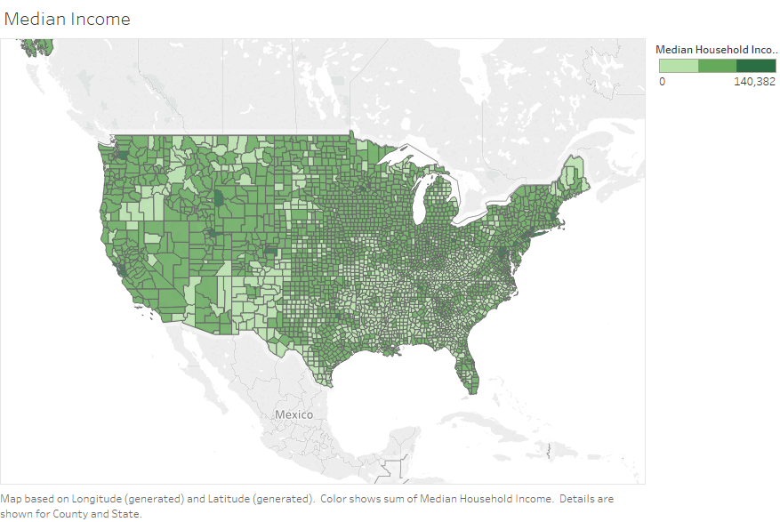
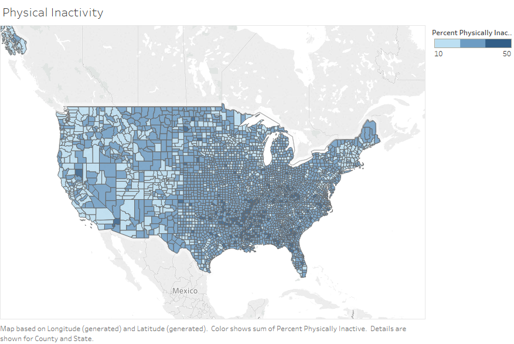

# Overview
We will be using Tableau as our project dashboard. Tableau is user-friendly and easy particular useful for xls and csv files, which is the format of our raw data. Our dashboard will include one interactive graph and several other visualizations outling our findings.

# Interactive Map
The interactive map aspect of our dashboard will be a map of the continental U.S., overlayed with county lines. This is done in Tableau using the 'Map' visualization and 'County' map layering. 

A color schema will be used to indicate the severity of heart disease mortality in each county, thereby giving the user and straight forward visual of where in the U.S. people succumb to heart disease at the highest rates per capita.

The user interaction comes in the form of pop-up markers. A user can click on a particular county and be shown a window with that county's heart disease mortality rate and top-5 impact metrics.

These metrics are determined by the model to be the most significant in predicting heart disease mortality rates.

# Additional Visualizations

Additionally, our dashboard will include other visualizations to highlight some tangential findings.